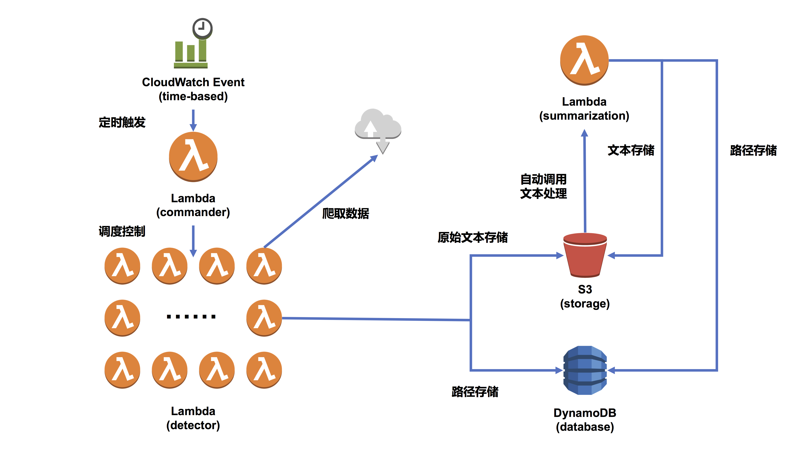
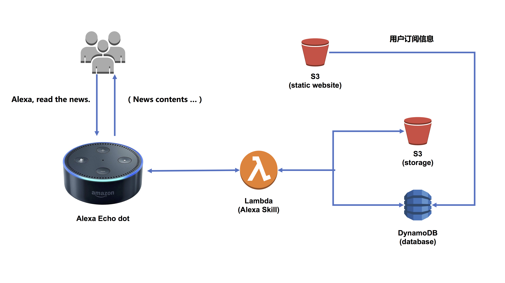

# Voixa  [Amazon Alexa Demo]


## Contents

- [Introduction](#Introduction)
- [Team Members](#Team_Members)
- [Architecture](#Architecture)
- [Version Information](#Version_Information)
    - [v0.8](#v0.8)
    - [v0.9](#v0.9)
- [Future Works](#Future_Works)
- [Deployment](#Deployment)


## [Introduction](id:Introduction)


**ps: If there is any questions or suggestions, please contact *[david.wang@finishy.cn](mailto:david.wang@finishy.cn)*.**

Voixa is a sample project using Amazon Alexa. In this project, we want to use Alexa and Echo to read the news that users are really interested in from the tons of news each day. Serverless architecture is used in this project to crawl data from the specified websites by users. Users can also specify keyword that they are interested in and Echo can read news related to the specified keywords.

This demo is for experimental purpose only. If you want to deploy your own application in cloud, please refer to the official website of AWS for more details. [中文版本](https://github.com/finishy1995/voixa/blob/master/readme-cn.md)

## [Team Members](id:Team_Members)

**Big Five Wolves Team**
1. ***@Bob Zhang***
2. ***@Nick Jiang***
3. ***@Haipeng Qi***
4. ***@Andrew Ren***
5. ***@David Wang***


## [Architecture](id:Architecture)

The data collection architecture is as follows：



The news reading by Echo is implemented as follows：




## [Version Information](id:Version_Information)

### [v0.8](id:v0.8)

Version for package test. There are many bugs or missing in the following versions, so use them with aution.

- v0.8.1
    - Demo origin code
    - Demo architecture
    - Beta AWS CloudFormation
- v0.8.2
    - Fix some bugs
    - Directed available AWS CloudFormation
    - Beta install.sh
- v0.8.3
    - Fix static web bugs
    - Add static web files auto upload
    - Cognito auto deploy and configuration

### [v0.9](id:v0.9)

Version for internal test. The following versions meet the minimum requirements and not guarantee all OS and conditions.

- v0.9.1
    - One step deployment
    - Fix policy bug in AWS CloudFormation
    - Rewrite Readme.md files


## [Future Works](id:Future_Works)

- [x] One step deployment using AWS CloudFormation
- [x] Readme for deployment details
- [x] Add Cognito to improve security
- [x] Add Demo architecture
- [x] Readme for both English & Chinese
- [ ] Add support for more OS and conditions
- [ ] Add support to more websites and keywords
- [ ] Polish Frontend UI and more functions
- [ ] App for Android & IOS


## [Deployment](id:Deployment)

**ps: The following steps are testing in Mac with aws-cli. If there is any issues in other OS or conditions, please let us know. Thank you!**

### Prerequisites

You must have AWS Global account with AdministratorAccess. (Actually, the deployment needn't such a big access)

### Installation aws-cli

If you have already installed aws-cli, this step can be skipped.

```sh
sudo pip install awscli
```

For more details，please refer to [aws-cli](https://github.com/aws/aws-cli)

### Configured aws-cli

If you have already configured aws-cli, this step can be skipped.

```sh
aws configure --profile ${your_profile_name}
```

Have a problem? please refer to [aws-cli](https://github.com/aws/aws-cli)

### Deployment Voixa

```sh
wget --no-check-certificate https://raw.githubusercontent.com/finishy1995/voixa/master/install.sh && chmod u+x install.sh && ./install.sh
```

### Configured Alexa

You can configured the Alexa Skill in [Amazon Developer](https://developer.amazon.com/).
During configuration，Lambda Arn can be found in AWS CloudFormation outputs.

### Specify keywords

Open the web page url which can be found in AWS CloudFormation outputs and specify keywords which you would like Alexa to read.

